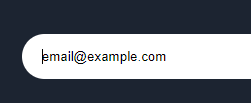
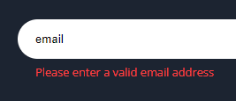

# Frontend Mentor - Fylo dark theme landing page solution

This is a solution to the [Fylo dark theme landing page challenge on Frontend Mentor](https://www.frontendmentor.io/challenges/fylo-dark-theme-landing-page-5ca5f2d21e82137ec91a50fd). Frontend Mentor challenges help you improve your coding skills by building realistic projects. 


## 📋 Table of contents
<hr>

- [Overview](#overview)
  - [The challenge](#the-challenge)
  - [Solution](#solution)
  - [Links](#links)
- [My process](#my-process)
  - [Built with](#built-with)
  - [What I learned](#what-i-learned)
  - [Useful resources](#useful-resources)
- [Author](#author)


## 🌐 Overview
<hr>

### 🧭 The challenge

Users should be able to:

- 📱 View the optimal layout for the site depending on their device's screen size (375px | 425px)
- 💻 See hover states for all interactive elements on the page

### 🎯 Solution

📄 _Entire Page_


✨ _Hover States_


📲 _Mobile Version_


### 🔗 Links

<!-- ✅ Solution URL: [Add solution URL here](https://your-solution-url.com) -->

✅ Live Site: [https://markshenrik.github.io/front-end-mentor-fylo/](https://markshenrik.github.io/front-end-mentor-fylo/)
<br><br>

## 👨‍💻 My process
<hr>

### 🛠 Built with

- Semantic HTML5 markup
- CSS custom properties
- Flexbox
- CSS Grid
- [Font Awesome](https://fontawesome.com/) - For icons
<br><br>

### 🚀 What I learned

During the last few months of learning HTML and CSS I had a lot of difficulty with creativity and structuring elements.
But with the help of some projects and exercises I did in the DevQuest front-end course, I could complete my very first project by myself.   
<br>
<br>
✍ Here's some code lines I wrote:

I used this CSS code for setting the curvy background image in the call-to-actions section.
<br>
🎨🎨🎨   
```css
.call-to-actions{
    text-align: center;
    background-color: hsl(217, 28%, 15%);
    background-image: url(../fylo-dark-theme-landing-page-master/images/bg-curvy-desktop.svg);
    background-repeat: no-repeat;
    background-position: bottom;
    height: 950px;
}
```


With this JavaScript code the webpage returns an alert message to the user about his/her email address.
<br>
🧠🧠🧠
```js
function validateEmail(){
    let email = document.querySelector('#email-input');
    let error = document.querySelector('#error-email');
    if(!email.checkValidity()){
        error.innerHTML = "Please enter a valid email address";
    }
}

function redefineMsg(){
    let error = document.querySelector('#error-email');
    if(error.innerHTML == "Please enter a valid email address"){
        error.innerHTML = "";
    }
}
```
💁‍♂️Before 
<br>
 

🙅‍♂️After 
<br>



### 🔧 Useful resources

- [[Tutorial] Validação de Email via JavaScript](https://www.youtube.com/watch?v=0EHlU55ZfbA&list=WL&index=1) - This Lucas Soares' YouTube video helped me to do the JS code for form validation alert.

## 🙋‍♂️ Author
<hr>

- Frontend Mentor - [@markshenrik](https://www.frontendmentor.io/profile/markshenrik)
- LinkedIn - [Marks Henrik](https://www.linkedin.com/in/marks-henrik)

