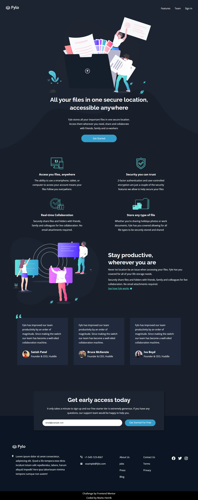

# Frontend Mentor - Fylo dark theme landing page solution

This is a solution to the [Fylo dark theme landing page challenge on Frontend Mentor](https://www.frontendmentor.io/challenges/fylo-dark-theme-landing-page-5ca5f2d21e82137ec91a50fd). Frontend Mentor challenges help you improve your coding skills by building realistic projects. 

## 📋 Table of contents

- [Overview](#overview)
  - [The challenge](#the-challenge)
  - [Solution](#solution)
  - [Links](#links)
  - [Built with](#built-with)
- [Author](#author)

## 🌐 Overview

### 🧭 The challenge

Users should be able to:

- 📱 View the optimal layout for the site depending on their device's screen size
- 💻 See hover states for all interactive elements on the page

### 🎯 Solution

📄 _Entire Page_

✨ _Hover States_

📲 _Mobile Version_

### 🔗 Links

✅ Live Site: [https://markshenrik.github.io/front-end-mentor-fylo/](https://markshenrik.github.io/front-end-mentor-fylo/)
  

### 🛠 Built with

- Semantic HTML5 markup
- CSS custom properties
- Flexbox
- Grid
  
## 🙋‍♂️ Author

- Frontend Mentor - [@markshenrik](https://www.frontendmentor.io/profile/markshenrik)
- LinkedIn - [Marks Henrik](https://www.linkedin.com/in/markshenrik/)

